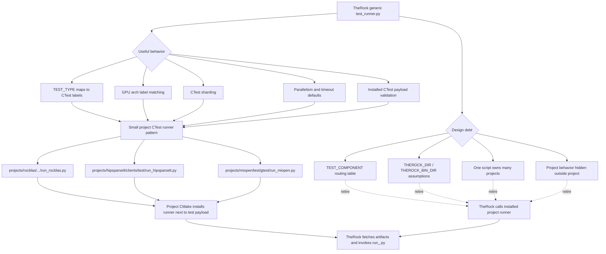

# rocm-libraries Test Runner Convergence

Date: 2026-05-04

## Goal

Converge the useful behavior from TheRock's generic `test_runner.py` into
project-owned installed runners without preserving the generic component router
as the long-term interface.

## Design Diagram

## Target Shape

- Each project owns a `run_<project>.py` script near the CMake logic that
  creates or installs its test payload.
- Each runner is installed beside the relevant executable, YAML file, or
  `CTestTestfile.cmake` that it executes.
- Runners derive `ROCM_PATH` from installed layout when possible, while allowing
  explicit `ROCM_PATH` for non-standard layouts.
- TheRock should treat installed runners as executable project artifacts, not as
  logic it needs to duplicate under `test/therock`.

## What We Keep From `test_runner.py`

- `TEST_TYPE` as the external CI knob.
- CTest category labels: `quick`, `standard`, `comprehensive`, `full`.
- GPU-specific label matching such as `gfx1151 -> gfx115X -> gfx11X`.
- CTest sharding through `--tests-information`.
- Conservative per-project defaults for timeout and parallelism.

## What We Do Not Keep

- A long-lived `TEST_COMPONENT` dispatch table.
- TheRock-specific path discovery in project-owned scripts.
- A single generic runner that silently changes behavior by environment.
- Shared abstraction before two or three project runners have stabilized.

## Migration Order

1. Finish the current hipSPARSELt correction in the sparse branch.
2. Split rocBLAS separately because it has ASAN behavior and YAML smoke-test
   handling.
3. Split MIOpen separately because its filtering logic is larger and more
   platform-specific.
4. Update TheRock component wiring one project at a time after the corresponding
   rocm-libraries runner lands.
5. Retire TheRock's generic `test_runner.py` after its remaining users have
   project-owned installed runners.
