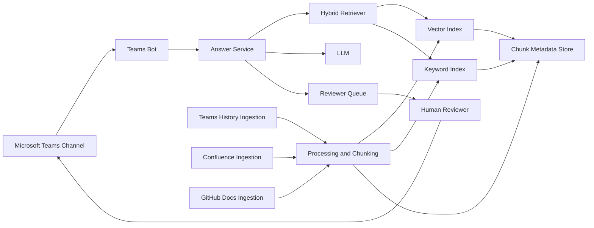
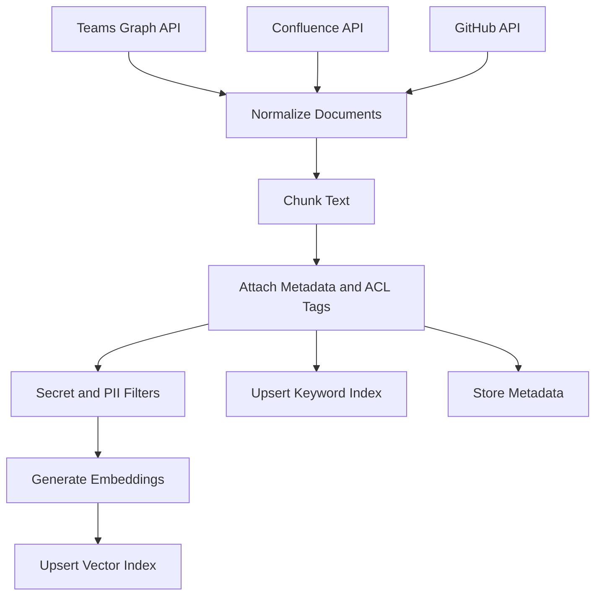
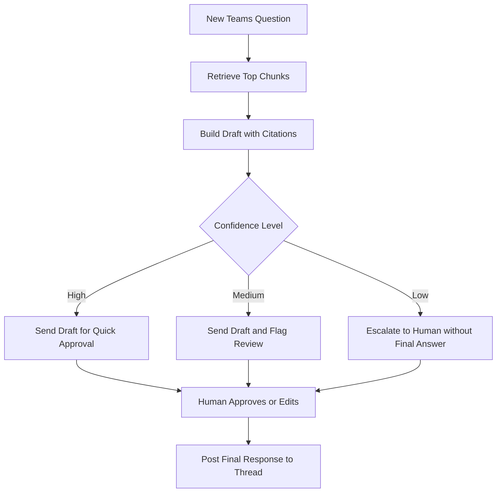
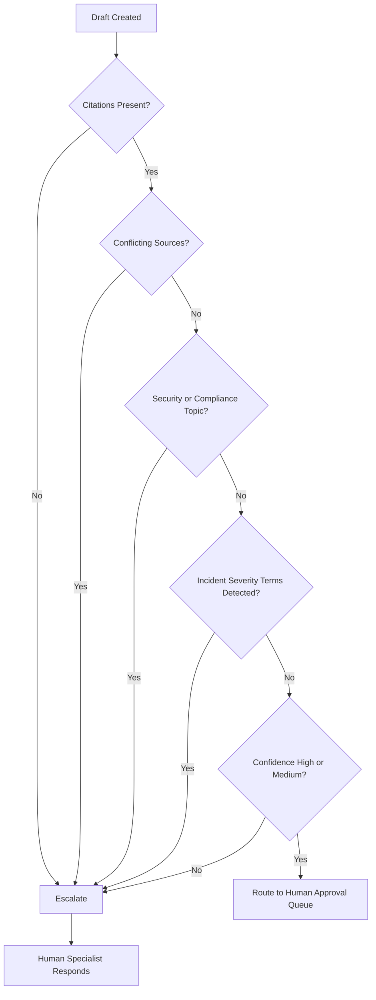

# Teams First-Response Agent MVP Plan (Beginner-Friendly)

## 1) Goal
Build an internal agent that provides first-level answers in a Microsoft Teams channel thread by using:
- Past human responses from that Teams channel
- Confluence documentation
- GitHub documentation/repos

For the first release, the agent should suggest a draft response with citations. A human approves before posting.

## 2) What "Good" Looks Like
Success metrics for MVP:
- 60%+ of agent drafts are accepted with minor edits
- Median time-to-first-response decreases by 30%
- 100% of agent answers include source citations
- 0 data-access violations (ACL leaks)

## 3) Scope (MVP)
In scope:
- 1 Teams channel
- 1 Confluence space
- 1-2 GitHub repos (docs first)
- Draft mode only (human-in-the-loop)

Out of scope for MVP:
- Full auto-reply
- Multi-channel rollout
- Code-level deep debugging from source trees

## 4) High-Level Architecture
1. Ingestion services
- Pull Teams thread history via Microsoft Graph
- Pull Confluence pages via Confluence REST API
- Pull GitHub docs via GitHub API

2. Processing pipeline
- Normalize text
- Chunk content into retrieval units
- Attach metadata (source URL, updated time, author, permissions)
- Generate embeddings

3. Knowledge store
- Vector index (semantic retrieval)
- Keyword index (exact terms like error IDs, ticket numbers)
- Metadata store (ACLs, timestamps, source type)

4. Runtime answer service
- Receive incoming Teams question
- Retrieve top relevant chunks (hybrid search)
- Build answer with citations
- Apply confidence policy: suggest draft or escalate

5. Teams bot integration
- Posts draft answer to a reviewer queue/thread state
- Human approves/edits/rejects
- Final response posted to the channel thread

## 4.1) Ingestion Data Flow

## 5) Data Model (Minimal)
Use these logical fields per chunk:
- `chunk_id`
- `source_type` (`teams`, `confluence`, `github`)
- `source_id` (message/page/file identifier)
- `source_url`
- `thread_id` (for Teams content)
- `author`
- `created_at`
- `updated_at`
- `acl_tags` (groups/users allowed)
- `text`
- `embedding`
- `quality_weight` (manual tuning, e.g. official docs > chat)

## 6) Retrieval and Ranking Strategy
Use hybrid retrieval:
1. Semantic search over embeddings (captures meaning)
2. Keyword/BM25 search (captures exact strings)
3. Merge and rerank using:
- Source priority (official docs > Teams chat history)
- Recency (newer content preferred)
- Similarity score
- Quality weight

Suggested source priority rule:
1. Confluence official runbooks
2. GitHub docs/README/wiki
3. Teams historical answers

## 7) Prompt Contract (Draft)
System behavior:
- Answer only from retrieved sources
- If sources conflict, say so and request human escalation
- Include citations for all substantive claims
- If confidence is low, do not guess

Response format:
- `Answer:` short and actionable
- `Why:` 1-2 lines
- `Sources:` bulleted links/titles
- `Confidence:` High/Medium/Low
- `Escalation:` Yes/No

## 8) Confidence and Escalation Rules
Start simple and deterministic:
- High: 2+ agreeing sources, at least one official doc, high retrieval score
- Medium: relevant sources found, minor ambiguity
- Low: sparse or conflicting sources

Escalate automatically when:
- Confidence is Low
- No citation available for key claim
- Security/compliance topics
- Incident severity language detected ("outage", "sev1", "data loss")

## 8.1) Escalation Decision Flow

## 9) Security and Compliance Guardrails
Mandatory controls:
- Enforce ACL checks at query time (not only ingest time)
- Do not ingest secrets from repos (scan and filter)
- Respect retention/deletion policies from source systems
- Log retrieval + response trace for audits
- Redact PII where required

## 9.1) Identity and Credential Model (Non-Personal Accounts)
Principle: no personal accounts or personal API tokens in production paths.

Required service identities:
- `sp-teams-ingest-prod`: Azure AD app/service principal for Microsoft Graph ingestion (read only)
- `sp-teams-bot-prod`: Azure Bot identity for Teams draft posting workflow
- `svc-confluence-rag-prod`: dedicated Confluence technical account (read only, approved spaces only)
- `gha-rag-reader-prod`: GitHub App (preferred) with read-only repo docs access
- `sp-rag-runtime-prod`: backend runtime identity for retrieval, LLM calls, and storage access

Environment separation:
- Separate identities per environment (`dev`, `test`, `prod`)
- No shared credentials between environments
- Prod credentials only usable from prod runtime

Credential standards:
- Prefer workload identity/managed identity over static secrets where possible
- If secrets are required, store only in enterprise secrets manager
- Enforce key/token rotation (for example every 90 days or stricter org policy)
- Break-glass credentials must be separate, time-bound, and fully audited

## 9.2) Minimum Permission Scope Matrix (Least Privilege)
Microsoft Teams / Graph:
- Read channel messages and replies only for approved team/channel IDs
- No mailbox access
- No write permission for ingestion principal
- Bot principal allowed to post drafts only in approved channel/thread context

Confluence:
- Read-only access to allowlisted spaces
- No edit, comment, or admin permissions
- Optional label-based page include/exclude policy for sensitive content

GitHub:
- GitHub App with read-only `Contents` and optionally `Metadata`
- Install only on allowlisted repositories
- No code write, no PR write, no admin scopes

Storage and indexes:
- Runtime principal can read/write only required storage containers and index resources
- Human users have no direct write path to vector/keyword index in production
- Deny-by-default network policy between services

LLM endpoint:
- Service principal/project-scoped API credential only
- Disable training on submitted enterprise data if provider offers that control
- Region and data-processing settings must match compliance requirements

## 9.3) Secrets Management and Key Rotation
Controls:
- All secrets in vault (for example Azure Key Vault)
- No secrets in source control, `.env` files, or pipeline logs
- Secret retrieval at runtime via managed identity
- Access to secret values restricted to runtime identities only

Rotation and lifecycle:
- Automated rotation where supported
- Manual rotation runbook for unsupported credentials
- Immediate rotation on suspected exposure
- Deprovision credentials immediately when connector is removed

## 9.4) Data Classification, Retention, and Privacy
Classification expectations:
- Teams/Confluence/GitHub data treated as internal by default
- Explicit denylist for restricted categories (credentials, regulated PII, legal hold material unless approved)

Retention:
- Raw ingested payload retention window (example: 30-90 days) per policy
- Derived chunks/embeddings retention aligned to source lifecycle
- Hard delete propagation when source content is deleted or access revoked

Privacy:
- PII minimization before indexing where practical
- Redaction pipeline for common sensitive patterns
- Do not include personal profile enrichment beyond source metadata needed for traceability

## 9.5) Audit Logging and Monitoring Requirements
Log events (immutable where possible):
- Authentication events for all service identities
- Ingestion job runs: source, object count, failures
- Retrieval traces: query ID, chunk IDs, source links, confidence, escalation decision
- Human review decisions: approved/edited/rejected and timestamp
- Administrative changes: scope updates, policy updates, connector enable/disable

Monitoring and alerts:
- Alert on unusual access patterns (spikes, off-hours, denied ACL attempts)
- Alert on secret read anomalies and repeated auth failures
- Alert on low-citation or no-citation response attempts
- Weekly access review report for InfoSec and system owner

## 9.6) Threat Model Summary and Mitigations
Threat: data leakage across channels/spaces/repos
- Mitigation: query-time ACL enforcement + integration tests with negative cases

Threat: prompt injection from source documents
- Mitigation: retrieval sanitizer, instruction hierarchy, and tool-use restrictions

Threat: hallucinated or unsafe guidance
- Mitigation: citation-required output, confidence gating, human approval in MVP

Threat: secret exposure from repos/docs
- Mitigation: pre-index secret scanning + blocklist filters + incident response runbook

Threat: over-privileged service principals
- Mitigation: least-privilege scope reviews and quarterly recertification

## 9.7) InfoSec Approval Evidence Checklist
Provide this package for approval:
- Data flow diagram with trust boundaries and egress points
- Identity inventory with owner, purpose, scopes, and rotation policy
- Permission screenshots/exports for Graph, Confluence, GitHub, vault, and storage
- Threat model and control mapping
- Retention/deletion policy and validation test evidence
- Audit log sample showing end-to-end traceability from question to response
- Incident response playbook (credential leak, bad response, unauthorized access)
- Pilot go-live risk acceptance signed by system owner and InfoSec

## 10) Implementation Plan (6 Weeks)
Week 1: Foundations
- Create app registrations/service principals
- Confirm API permissions for Graph, Confluence, GitHub
- Choose storage/index stack
- Define success metrics and acceptance criteria

Week 2: Ingestion connectors
- Build Teams history extractor
- Build Confluence extractor
- Build GitHub docs extractor
- Save normalized raw documents

Week 3: Indexing pipeline
- Add chunking strategy
- Add embeddings + vector index
- Add keyword index
- Store metadata with ACL tags

Week 4: Answer service
- Implement hybrid retrieval
- Implement prompt + citation formatting
- Add confidence scoring and escalation logic

Week 5: Teams bot workflow
- Wire bot to channel
- Draft-mode UX for human review/approval
- Add feedback capture (accepted/edited/rejected)

Week 6: Pilot and tuning
- Run pilot with selected team
- Review false positives/low-quality drafts
- Tune ranking weights and prompts
- Decide go/no-go for broader rollout

## 11) Technology Choices (Pragmatic Defaults)
Pick any equivalent stack, but defaults are:
- Backend: Python FastAPI or Node.js
- Queue/Jobs: Azure Functions or background workers
- Vector DB: Azure AI Search, Pinecone, or pgvector
- Keyword search: same engine if hybrid supported
- Storage: Azure Blob + Postgres metadata
- LLM: enterprise-approved model endpoint

## 12) Starter Backlog (First Tickets)
1. "Create Teams channel connector with pagination and delta sync"
2. "Create Confluence crawler for one space with page metadata"
3. "Create GitHub docs ingester for /docs and README files"
4. "Implement chunker with overlap and metadata attachment"
5. "Create embedding pipeline and vector index upsert"
6. "Implement hybrid retriever + source-priority reranker"
7. "Add response template with citations and confidence label"
8. "Implement escalation policy and reviewer handoff"
9. "Add audit logging for query, retrieval set, and answer"
10. "Build pilot dashboard with acceptance/edit metrics"

## 13) Risks and Mitigations
Risk: Bad historical human answers are retrieved
- Mitigation: Source weighting, freshness checks, and downrank unverified chat answers

Risk: Permission leakage across users/channels
- Mitigation: Strict ACL filtering at retrieval + integration tests

Risk: Hallucinated answers
- Mitigation: Citation-required output + low-confidence escalation

Risk: Over-answering beyond first-level support
- Mitigation: Intent classifier and strict escalation boundaries

## 14) Rollout Checklist
- Security review completed
- API scopes approved by IT
- Pilot users trained on approve/edit/reject workflow
- Incident escalation path documented
- Operational owner assigned
- SLA for human fallback confirmed

## 15) Next Step for You
Start with a design review meeting using this document, then lock:
1. MVP scope boundaries
2. Source priority policy
3. Escalation policy
4. Success metrics for a 2-4 week pilot

## 16) InfoSec Control Mapping (For Security Intake)
Use this section to map design controls to common security review domains.

### 16.1) IAM and Access Control
Objectives:
- Enforce least privilege
- Prevent use of personal credentials
- Ensure access is auditable and reviewable

Implemented controls:
- Dedicated service identities per system and per environment (Section 9.1)
- Scope-limited permissions for Graph, Confluence, and GitHub (Section 9.2)
- Query-time ACL enforcement on every retrieval request (Sections 5, 9)
- Quarterly access recertification for service principals and app installs (Section 9.6)

Evidence:
- Identity inventory with owners and scope exports
- Access review records and approval history

### 16.2) Data Protection and Privacy
Objectives:
- Protect internal and sensitive data
- Minimize unnecessary retention
- Support deletion and revocation requirements

Implemented controls:
- Data classification defaults and restricted-content denylist (Section 9.4)
- PII minimization/redaction before indexing (Sections 9, 9.4)
- Retention windows for raw and derived data (Section 9.4)
- Delete propagation when source content is removed or permissions change (Section 9.4)

Evidence:
- Retention policy configuration
- Redaction/filter test results
- Deletion propagation test logs

### 16.3) Application Security (AppSec)
Objectives:
- Prevent unsafe model behavior and injection abuse
- Reduce hallucinations and unsafe automation decisions

Implemented controls:
- Citation-required answer policy (Sections 7, 8)
- Confidence gating and mandatory human approval in MVP (Sections 8, 8.1)
- Prompt injection mitigation via retrieval sanitization and instruction hierarchy (Section 9.6)
- Secrets scanning and filtering before indexing (Sections 9, 9.6)

Evidence:
- Prompt/policy configuration
- Red-team or abuse-case test results
- Sample traces showing escalation on low confidence

### 16.4) Logging, Monitoring, and Detection
Objectives:
- Ensure full traceability
- Detect abuse, drift, and anomalous access quickly

Implemented controls:
- End-to-end audit logs for auth, ingestion, retrieval, and reviewer actions (Section 9.5)
- Alerts for ACL denials, auth failures, anomalous access, and no-citation attempts (Section 9.5)
- Weekly governance reporting to owner and InfoSec (Section 9.5)

Evidence:
- SIEM dashboard screenshots/queries
- Alert routing and on-call ownership
- Weekly report artifacts

### 16.5) Incident Response and Recovery
Objectives:
- Respond quickly to leaks, misconfigurations, or harmful responses
- Restore secure operations with minimal downtime

Implemented controls:
- Credential rotation and emergency revocation runbooks (Section 9.3)
- Playbooks for unauthorized access and bad-response incidents (Section 9.7)
- Human escalation path for sensitive/high-risk requests (Sections 8, 8.1)

Evidence:
- Incident runbooks
- Tabletop exercise notes
- Mean-time-to-revoke and mean-time-to-contain metrics

### 16.6) Third-Party and Vendor Risk
Objectives:
- Manage risk from external platforms and model providers
- Ensure contractual and technical controls are aligned

Implemented controls:
- Approved enterprise endpoints only for LLM and storage (Sections 11, 9.2)
- Provider data-handling controls aligned to org policy (Section 9.2)
- Scoped GitHub App installation and constrained Confluence space access (Section 9.2)

Evidence:
- Vendor security review references
- Contractual data-processing terms
- Architecture diagram showing external dependencies

### 16.7) Change Management and Governance
Objectives:
- Control production changes
- Ensure clear accountability for risk decisions

Implemented controls:
- Phased rollout with pilot gating and go/no-go checkpoints (Section 10)
- Security review and API scope approval prerequisites (Section 14)
- Explicit ownership and SLA for human fallback (Section 14)

Evidence:
- CAB/change tickets
- Approval records for prod promotion
- Post-pilot risk acceptance sign-off

### 16.8) Security Sign-Off Template
Use this checklist in the approval ticket:
- IAM owner approved service identities and scopes
- InfoSec approved data classification, retention, and deletion controls
- AppSec approved prompt safety and injection mitigations
- SOC/Monitoring approved logging coverage and alert routing
- Incident Response owner approved playbooks and escalation paths
- System owner accepted residual pilot risk and go-live conditions
