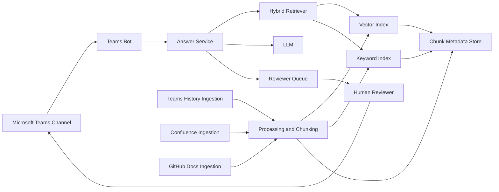
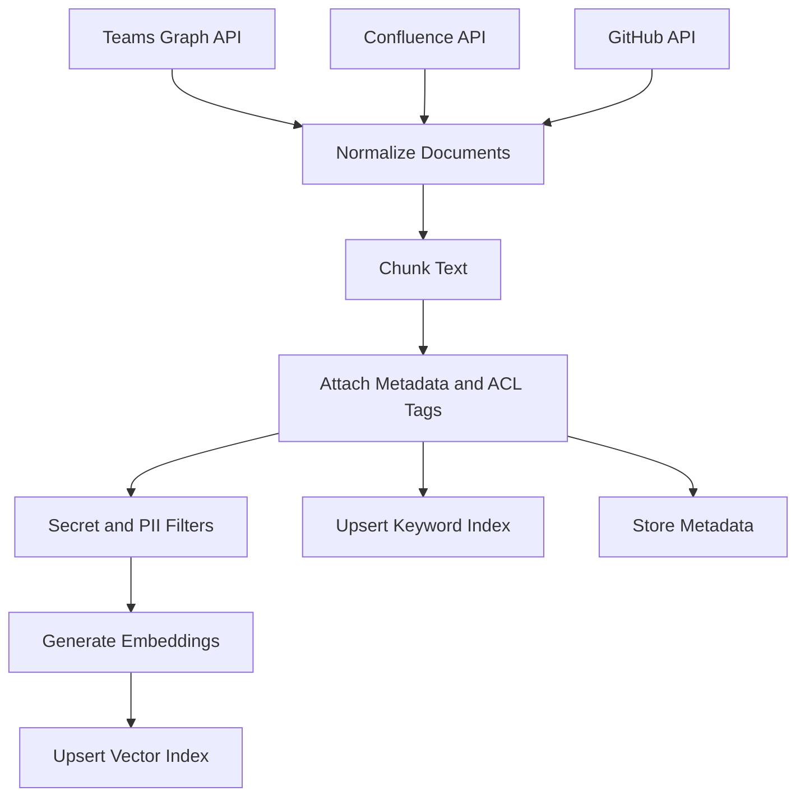
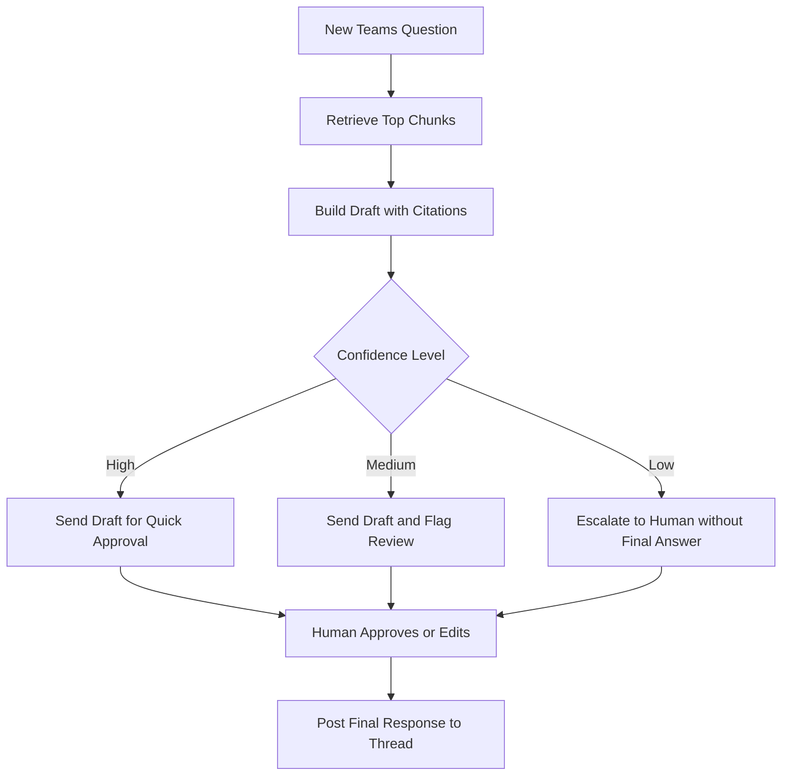
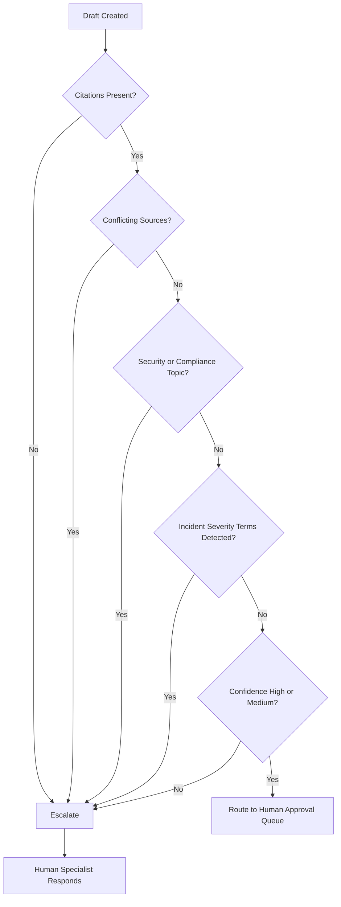

# Teams First-Response Agent MVP Plan (Beginner-Friendly)

## 1) Goal
Build an internal agent that provides first-level answers in a Microsoft Teams channel thread by using:
- Past human responses from that Teams channel
- Confluence documentation
- GitHub documentation/repos

For the first release, the agent should suggest a draft response with citations. A human approves before posting.

## 2) What "Good" Looks Like
Success metrics for MVP:
- 60%+ of agent drafts are accepted with minor edits
- Median time-to-first-response decreases by 30%
- 100% of agent answers include source citations
- 0 data-access violations (ACL leaks)

## 3) Scope (MVP)
In scope:
- 1 Teams channel
- 1 Confluence space
- 1-2 GitHub repos (docs first)
- Draft mode only (human-in-the-loop)

Out of scope for MVP:
- Full auto-reply
- Multi-channel rollout
- Code-level deep debugging from source trees

## 4) High-Level Architecture
1. Ingestion services
- Pull Teams thread history via Microsoft Graph
- Pull Confluence pages via Confluence REST API
- Pull GitHub docs via GitHub API

2. Processing pipeline
- Normalize text
- Chunk content into retrieval units
- Attach metadata (source URL, updated time, author, permissions)
- Generate embeddings

3. Knowledge store
- Vector index (semantic retrieval)
- Keyword index (exact terms like error IDs, ticket numbers)
- Metadata store (ACLs, timestamps, source type)

4. Runtime answer service
- Receive incoming Teams question
- Retrieve top relevant chunks (hybrid search)
- Build answer with citations
- Apply confidence policy: suggest draft or escalate

5. Teams bot integration
- Posts draft answer to a reviewer queue/thread state
- Human approves/edits/rejects
- Final response posted to the channel thread

## 4.1) Ingestion Data Flow

## 5) Data Model (Minimal)
Use these logical fields per chunk:
- `chunk_id`
- `source_type` (`teams`, `confluence`, `github`)
- `source_id` (message/page/file identifier)
- `source_url`
- `thread_id` (for Teams content)
- `author`
- `created_at`
- `updated_at`
- `acl_tags` (groups/users allowed)
- `text`
- `embedding`
- `quality_weight` (manual tuning, e.g. official docs > chat)

## 6) Retrieval and Ranking Strategy
Use hybrid retrieval:
1. Semantic search over embeddings (captures meaning)
2. Keyword/BM25 search (captures exact strings)
3. Merge and rerank using:
- Source priority (official docs > Teams chat history)
- Recency (newer content preferred)
- Similarity score
- Quality weight

Suggested source priority rule:
1. Confluence official runbooks
2. GitHub docs/README/wiki
3. Teams historical answers

## 7) Prompt Contract (Draft)
System behavior:
- Answer only from retrieved sources
- If sources conflict, say so and request human escalation
- Include citations for all substantive claims
- If confidence is low, do not guess

Response format:
- `Answer:` short and actionable
- `Why:` 1-2 lines
- `Sources:` bulleted links/titles
- `Confidence:` High/Medium/Low
- `Escalation:` Yes/No

## 8) Confidence and Escalation Rules
Start simple and deterministic:
- High: 2+ agreeing sources, at least one official doc, high retrieval score
- Medium: relevant sources found, minor ambiguity
- Low: sparse or conflicting sources

Escalate automatically when:
- Confidence is Low
- No citation available for key claim
- Security/compliance topics
- Incident severity language detected ("outage", "sev1", "data loss")

## 8.1) Escalation Decision Flow

## 9) Security and Compliance Guardrails
Mandatory controls:
- Enforce ACL checks at query time (not only ingest time)
- Do not ingest secrets from repos (scan and filter)
- Respect retention/deletion policies from source systems
- Log retrieval + response trace for audits
- Redact PII where required

## 10) Implementation Plan (6 Weeks)
Week 1: Foundations
- Create app registrations/service principals
- Confirm API permissions for Graph, Confluence, GitHub
- Choose storage/index stack
- Define success metrics and acceptance criteria

Week 2: Ingestion connectors
- Build Teams history extractor
- Build Confluence extractor
- Build GitHub docs extractor
- Save normalized raw documents

Week 3: Indexing pipeline
- Add chunking strategy
- Add embeddings + vector index
- Add keyword index
- Store metadata with ACL tags

Week 4: Answer service
- Implement hybrid retrieval
- Implement prompt + citation formatting
- Add confidence scoring and escalation logic

Week 5: Teams bot workflow
- Wire bot to channel
- Draft-mode UX for human review/approval
- Add feedback capture (accepted/edited/rejected)

Week 6: Pilot and tuning
- Run pilot with selected team
- Review false positives/low-quality drafts
- Tune ranking weights and prompts
- Decide go/no-go for broader rollout

## 11) Technology Choices (Pragmatic Defaults)
Pick any equivalent stack, but defaults are:
- Backend: Python FastAPI or Node.js
- Queue/Jobs: Azure Functions or background workers
- Vector DB: Azure AI Search, Pinecone, or pgvector
- Keyword search: same engine if hybrid supported
- Storage: Azure Blob + Postgres metadata
- LLM: enterprise-approved model endpoint

## 12) Starter Backlog (First Tickets)
1. "Create Teams channel connector with pagination and delta sync"
2. "Create Confluence crawler for one space with page metadata"
3. "Create GitHub docs ingester for /docs and README files"
4. "Implement chunker with overlap and metadata attachment"
5. "Create embedding pipeline and vector index upsert"
6. "Implement hybrid retriever + source-priority reranker"
7. "Add response template with citations and confidence label"
8. "Implement escalation policy and reviewer handoff"
9. "Add audit logging for query, retrieval set, and answer"
10. "Build pilot dashboard with acceptance/edit metrics"

## 13) Risks and Mitigations
Risk: Bad historical human answers are retrieved
- Mitigation: Source weighting, freshness checks, and downrank unverified chat answers

Risk: Permission leakage across users/channels
- Mitigation: Strict ACL filtering at retrieval + integration tests

Risk: Hallucinated answers
- Mitigation: Citation-required output + low-confidence escalation

Risk: Over-answering beyond first-level support
- Mitigation: Intent classifier and strict escalation boundaries

## 14) Rollout Checklist
- Security review completed
- API scopes approved by IT
- Pilot users trained on approve/edit/reject workflow
- Incident escalation path documented
- Operational owner assigned
- SLA for human fallback confirmed

## 15) Next Step for You
Start with a design review meeting using this document, then lock:
1. MVP scope boundaries
2. Source priority policy
3. Escalation policy
4. Success metrics for a 2-4 week pilot
